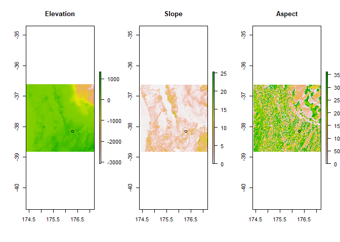
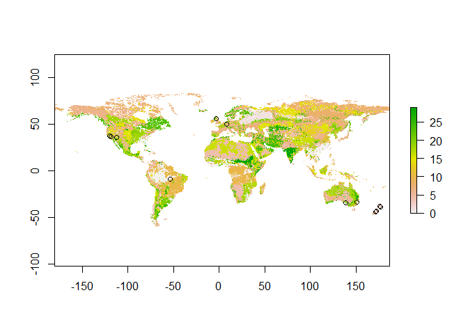
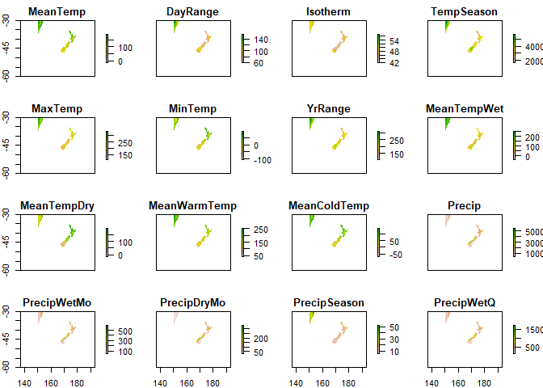

Accessing Environmental Data
================
Thomas Carlin
23/09/2021

## Introduction

This guide is intended to help access elevation, climate, and soil data
for any given set of coordinates. Data and necessary R scripts for this
guide can be found in Q:/Tree Root Microbiome/RA 3 Characterising the
soil environment/Projects/Envirotyping data

## Preparing your R script

You should begin by setting your working directory. Your working
directory is the folder that R will look in for any data you read into R
and is the location R will save files to.

For the purpose of this guide I will work from the Q drive, however you
will probably want to set this as a folder dedicated for your own work.

Note: Although these functions will work from the Q drive, the climate
function in particular will work much quicker if you’re working from,
for example, your C drive. This requires you to change the file path of
on line 51 of the “functions.R” file where it says path=“…”.

``` r
setwd("Q:/Tree Root Microbiome/RA 3  Characterising the soil environment/Projects/Envirotyping data")
```

We also need to make sure we have all necessary packages installed. The
functions for collecting environmental data used here require the three
packages: “elevatr”, “raster”, “rgdal”. The first time we use these
packages we need to install them (if you already have these packages
installed you can skip this step). I already have these packages
installed so these lines have been commented out by placing \# at the
beginning. Code after a \# is considered a comment, and hence isn’t run
by R.

``` r
# install.packages("elevatr")
# install.packages("raster")
# install.packages("rgdal")
```

Next, we need to tell R what the functions are that we’re going to be
using. We can do this by “sourcing” the “functions.R” file found in our
working directory. (Note that we can also source files by opening them
and clicking the “Source” button at the top of the R script)

There are 4 different functions in the “functions.R” file: elevation(),
climate(), soil(), and environs(). elevation(), climate(), soil()
provide elevation, climate, and soil data only but give the option of
plotting, while environs() combines all these data without plotting (to
reduce time).

``` r
source('Q:/Tree Root Microbiome/RA 3  Characterising the soil environment/Projects/Envirotyping data/functions.R')
```

## Reading in data

Now we have everything set up we just need to read in our coordinate
data. We can easily read in excel files that are saved as “csv”. We need
to remember to assign our data to an object in R by using “\<-”. (Note
.txt files can be read in using read.table() instead of read.csv)

The coordinate projection we’re using is WGS84. If our coordinates are
not in WGS84, we will need to reproject them into WGS84.

``` r
data <- read.csv("test_data.csv")
head(data)
```

    ##                    SampleID Longitude  Latitude
    ## 1                  Redwoods  176.2812 -38.15585
    ## 2          Kaingaroa forest  176.6358 -38.38309
    ## 3             Ashley forest  172.5746 -43.16295
    ## 4               Peel forest  171.2378 -43.89805
    ## 5       Blue mountains, SYD  150.5710 -33.56014
    ## 6 Hawkesbury institute, SYD  150.7488 -33.61297

This data has 3 columns - location names, longitude, and latitude. We
only need the coordinate values to progress, but because these name
locations are included we will convert them to rownames. (If you only
have 2 columns of coordinate data, skip this step)

``` r
df <- data[,2:3]
rownames(df) <- data[,1]
head(df)
```

    ##                           Longitude  Latitude
    ## Redwoods                   176.2812 -38.15585
    ## Kaingaroa forest           176.6358 -38.38309
    ## Ashley forest              172.5746 -43.16295
    ## Peel forest                171.2378 -43.89805
    ## Blue mountains, SYD        150.5710 -33.56014
    ## Hawkesbury institute, SYD  150.7488 -33.61297

## Using the environs() function to get environmental data.

If you’re only interested in getting the data, simply input your
dataframe into the environs function. This will return data on
elevation, climate, and soil data according to the coordinates entered.
Remember to assign the new environmental data to an object using “\<-”.
This can be the same object as before (df) or a new one like below. (We
will break this function down into its components later)

``` r
df2 <- environs(df)
head(df2)
```

    ##                                lon       lat Elevation     Slope    Aspect
    ## Redwoods                  176.2812 -38.15585       345 5.4916989 325.47093
    ## Kaingaroa forest          176.6358 -38.38309       442 0.8074823  30.86775
    ## Ashley forest             172.5746 -43.16295       247 4.5965873 132.54947
    ## Peel forest               171.2378 -43.89805       392 9.1859379 158.61000
    ## Blue mountains, SYD       150.5710 -33.56014       441 4.3262055 249.27041
    ## Hawkesbury institute, SYD 150.7488 -33.61297        27 0.2175010  65.70275
    ##                                Soil MeanTemp DayRange Isotherm TempSeason
    ## Redwoods                   Andosols     12.5      9.5       47      36.07
    ## Kaingaroa forest           Andosols     12.0      9.7       47      36.42
    ## Ashley forest             Cambisols     10.9      9.1       46      36.57
    ## Peel forest               Cambisols      9.5      9.7       46      39.39
    ## Blue mountains, SYD       Cambisols     14.8     12.1       48      45.19
    ## Hawkesbury institute, SYD Phaeozems     17.1     12.7       49      44.64
    ##                           MaxTemp MinTemp YrRange MeanTempWet MeanTempDry
    ## Redwoods                     22.9     2.8     201         7.8        17.1
    ## Kaingaroa forest             22.7     2.3     204         7.3        15.1
    ## Ashley forest                20.8     1.2     196         5.9        15.4
    ## Peel forest                  20.1    -0.7     208        11.4         4.8
    ## Blue mountains, SYD          26.9     1.9     250        20.0         9.7
    ## Hawkesbury institute, SYD    28.9     3.4     255        22.2        12.1
    ##                           MeanWarmTemp MeanColdTemp Precip PrecipWetMo
    ## Redwoods                          17.1          7.8   1581         165
    ## Kaingaroa forest                  16.6          7.3   1543         152
    ## Ashley forest                     15.4          5.9    739          74
    ## Peel forest                       14.3          4.1    936          87
    ## Blue mountains, SYD               20.3          8.7   1276         195
    ## Hawkesbury institute, SYD         22.5         11.1    900         122
    ##                           PrecipDryMo PrecipSeason PrecipWetQ PrecipDryQ
    ## Redwoods                          110           12        455        361
    ## Kaingaroa forest                  111           10        428        350
    ## Ashley forest                      51           12        201        165
    ## Peel forest                        58           11        250        207
    ## Blue mountains, SYD                54           40        512        170
    ## Hawkesbury institute, SYD          40           33        336        133
    ##                           PrecipWarmQ PrecipColdQ
    ## Redwoods                          361         455
    ## Kaingaroa forest                  354         428
    ## Ashley forest                     165         201
    ## Peel forest                       246         217
    ## Blue mountains, SYD               477         210
    ## Hawkesbury institute, SYD         310         160

Above we can see the full dataframe produced.

## Save data to use outside R

We can easily save this file as a csv, and either keep it in R or open
it in excel or other software.

``` r
write.csv(df2,"environmental_data.csv")
```

## Individual functions

As previously stated, environs() combines the results from the
elevation(), soil(), and climate() functions. We can use each of these
individually if we want to. Note that elevation(), soil(), and climate()
provide plotting options (by including the argument plot=TRUE).

``` r
df3 <- elevation(df[1,], plot=TRUE) # Note that df[1,] indicates I'm using only the first row of the df
```

<!-- -->

The elevation function downloads specific elevation raster tiles as and
when they’re needed. It then calculates slope and aspect for each of
these raster tiles. Then the supplied coordinates are overlaid onto
these raster tiles, and the elevation, slope, and aspect values are
extracted at these points.

More information on the elevation data can be found here:
<https://github.com/tilezen/joerd/blob/master/docs/data-sources.md#what-is-the-ground-resolution>

``` r
df4 <- soil(df, plot=TRUE)
```

<!-- -->

The soil function works differently than the elevation/climate
functions. Rather than downloading data from the internet, this step has
already been done (because it required special software - this can be
recreated using: Q:/Tree Root Microbiome/RA 3 Characterising the soil
environment/Projects/Envirotyping data/soil.R)

Instead, the soil function simply accesses the data from the wrb.tif
file located in the working directory. It reads this tif file into R as
a raster, overlays points, then extracts the soil data at each of those
points. Make sure your working directory contains BOTH the “wrb.tif”
file and the “wrb.tif.aux” file. The .aux file contains information that
R will use to automatically match the soil class number (seen as the
legend on the map above) to a soil class type.

More information on the soil data can be found here:
<https://www.isric.org/explore/soilgrids>

``` r
df5 <- climate(df[1,], plot=TRUE) # Note that df2[1,] indicates I'm using only the first row of the df2 
```

<!-- -->

The climate function works similarly to the elevation function - it
downloads individual raster tiles as and when needed, then overlays
coordinates and extracts climate data at each point. There are 19
climate variables, so if you use the plot=TRUE argument, expect a lot of
plots.

More information of the climate data can be found here:
<https://www.worldclim.org/data/bioclim.html>
